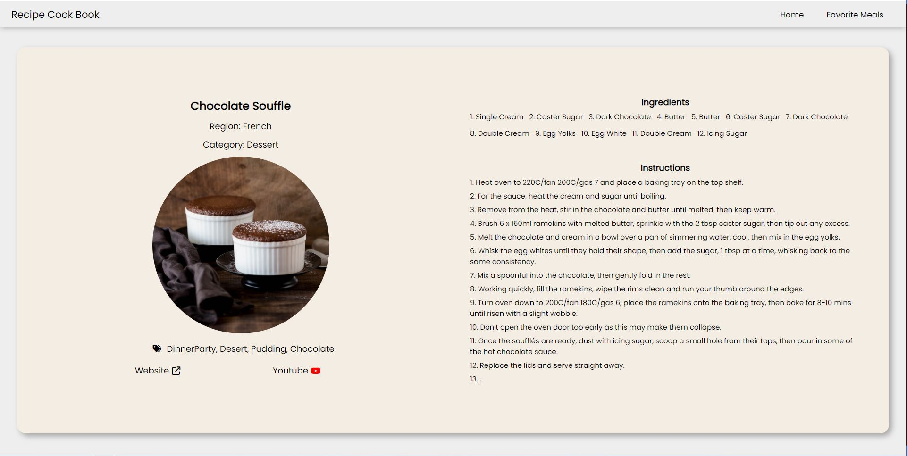

<h1>The Recipe CookBook</h1>

## Features

- A user can search for meals in the Recipe Cook Book
  

- A user can see a random meal from the Recipe Cook Book
  

- A user can save recipes from their searches as favorite meals
  

- A user can view their favorite meals from the Recipe Cook Book
  

- A user can navigate to a single recipe page view
  

- Web Application is responsive for various screen sizes
  

## Tools

- React
- TheMealDB API
- Visual Studio Code
- Font Awesome Icons

## Getting Started

Follow the following steps to setup and run the project on your local machine

### Install

Install the dependencies by running `npm install`

### Usage

Start the local server by running `npm start`

## Author

Tommy Liang

- Github [@TommyLiang1](https://github.com/TommyLiang1)
- LinkedIn [@TommyLiang](https://linkedin.com/in/TommyLiang131)

## Show your support

Give a ⭐️ if you like this project!
